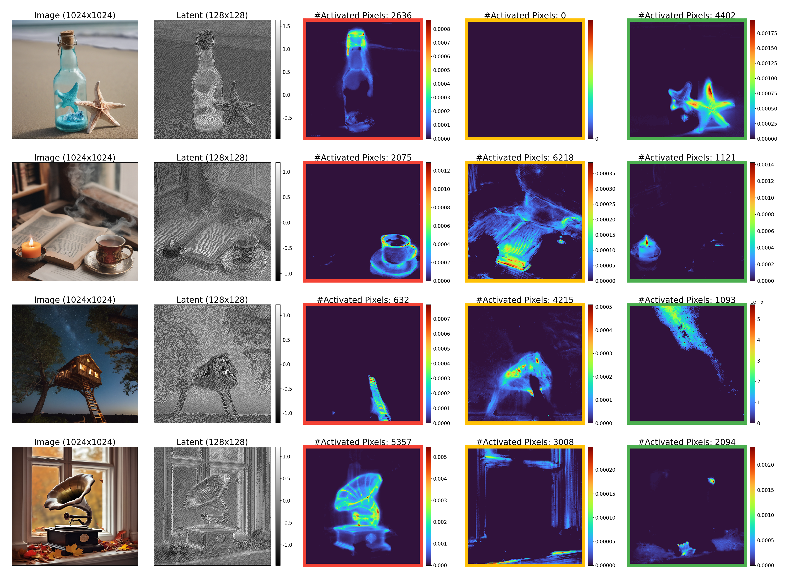

# CompLift for Text-to-Image Generation

<p align="center">

<br>
Our CompLift approach offers a straightforward solution to improve diffusion models without any extra training. When using regular diffusion models (shown above), combining multiple concepts in one generation often results in missing or incorrectly rendered elements. CompLift (displayed below) solves this problem by introducing a smart rejection way that measures how well each generated sample matches its intended description. By comparing how the model reconstructs images with and without the condition, CompLift can identify and accept only the aligned results.
</p>

## Setup

### Environment
Our code builds on the requirement of the official [Attend-and-Excite repository](https://github.com/yuval-alaluf/Attend-and-Excite). To set up their environment, please run:

```
conda env create -f environment/environment.yaml
conda activate ldm
```

On top of these requirements, we add several requirements which can be found in `environment/requirements.txt`. These requirements will be installed in the above command.

### Hugging Face Diffusers Library
Our code relies also on Hugging Face's [diffusers](https://github.com/huggingface/diffusers) library for downloading the Stable Diffusion v1.4 model.


## Quickstart Notebook

We provide a Jupyter notebook [notebooks/t2i.ipynb](notebooks/t2i.ipynb) to ramp up and get familiar with the basic setting. In this script, you can generate four images in the following picture, and plot the activated pixels using lift score for each component.

<p align="center">

<br>
Example of activated pixels using lift score for each component.
</p>

## Usage

<p align="center">

<br>
Example of accepted and rejected generated images using CompLift.
</p>

**To generate an image**, you can simply run the `run.py` script. For example,
```bash
python run.py --prompt "a cat and a dog" --seeds [0] --sd_xl=True --run_standard_sd=True --save_intermediate_latent=True --output_path "outputs/example"
```

Notes:
- The script uses Stable Diffusion 1.4 by default.
- To use Stable Diffusion 2.1, specify: `--sd_2_1 True`
- To use Stable Diffusion XL, specify: `--sd_xl True`
- If you wish to run the standard Stable Diffusion model with Attend-and-Excite, you can do so by passing `--run_standard_sd False`.
- `save_intermediate_latent` saves the intermediate latents which is needed for the computation of Cached CompLift.
- All parameters are defined in `config.py` and are set to their defaults according to the official paper.

All generated images will be saved to the path `"{config.output_path}/{prompt}"`. A grid of all images (in the case of multiple seeds) will be saved under `config.output_path`.

**To get the network prediction**, you can use `analyze_logp.py` script. For example,
```bash
python analyze_logp.py --prompt "a cat and a dog" --sd_xl True --n_samples 1000 --output_path "outputs/example" --components "['a cat', 'a dog']"
```

Notes:
- `n_samples` is the number of trials to use for the lift score calculation.

The result will be saved to the path `"{config.output_path}/{prompt}"`, where `*_score_results.pt` is the result for the vanilla CompLift, and `*_cached_score_results.pt` is the result for the Cached CompLift. `*_score_results.pt` stores a tensor `X` with shape `(1, n_component+2, n_trials, *latent_shape)`, which is `(1, 4, 200, 4, 128, 128)` in this example. `X` basically stores the predicted epsilon for each combination of trial and component. `X[:, 0]` is the predictions for the composed prompt, `X[0, -1]` is the predictions for the unconditional prompt `""`, and `X[:, 1:-1]` is the predictions for the individual components.

Then the CompLift score on the latent can be easily calculated as:
```python
((X[0, -1] - X[0, 0]).pow(2) - (X[0, i] - X[0, 0]).pow(2)).mean(dim=(0, 1, 2))
```
`i` represents the component index.

CompLift score on the image can be computed by:
```python
torch.logical_and([
    (((X[0, -1] - X[0, 0]).pow(2) - (X[0, i] - X[0, 0]).pow(2)).mean(dim=(0, 1, 2)) > epsilon).float().sum() > tau
    for i in range(1, X.shape[1]-1)
])
```
where `epsilon` is typically a small number such as `1e-5`, and `tau` is the threshold for pixel number such as `250`. For simplicity we did not mention `epsilon` in the paper, but we find it useful for numerical stability in practice.

## Metrics
We provide the script [scripts/generate_metrics.py](scripts/generate_metrics.py) to generate metrics csv files at the output folder. In its `main` part, you can see the examples as:
```python
for folder in ["outputs/standard_sd_1_4",
               "outputs/standard_sd_2_1",
               "outputs/standard_sd_xl",
              ]:
    generate_metrics(folder)
    add_image_reward_scores(folder)
```

To run this script, use the following command after you have generated the images:
```bash
python -m scripts.generate_metrics
```

Please check [Attend-and-Excite](https://github.com/AttendAndExcite/Attend-and-Excite) for the details of the python scripts under `metrics` folder.

### End-to-End Evaluation
Check [batch_run.sh](batch_run.sh) for the whole procedure to run the end-to-end evaluation, starting from generating images to getting the final latex table.

## Acknowledgements
- [Attend-and-Excite](https://github.com/AttendAndExcite/Attend-and-Excite)
- [Diffusion Classifier](https://github.com/diffusion-classifier/diffusion-classifier)
- [diffusers](https://github.com/huggingface/diffusers)
- [Prompt-to-Prompt](https://github.com/google/prompt-to-prompt/)

## Citation
If you use this code for your research, please cite the following work:
```
```
